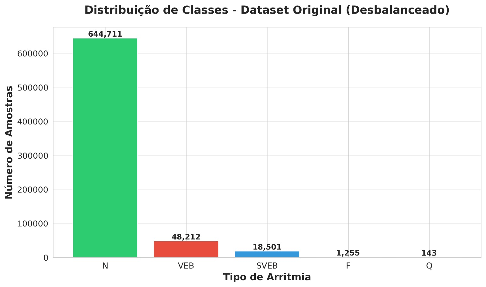
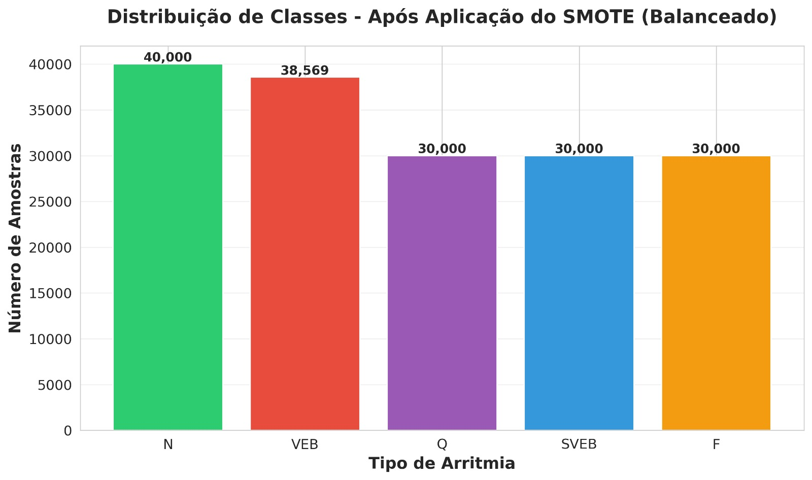
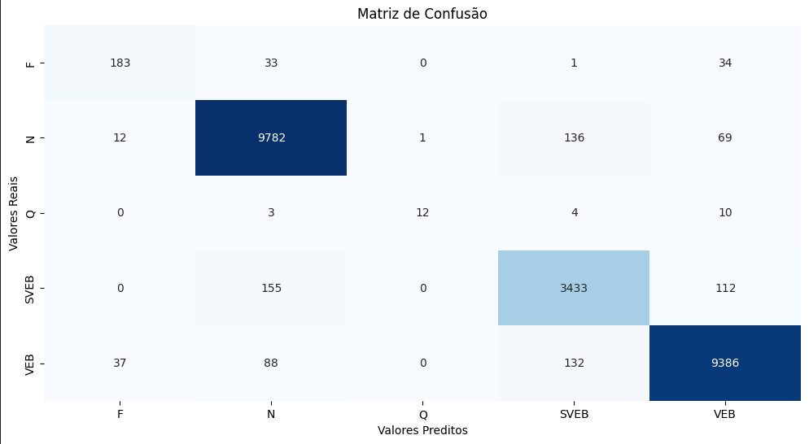

# Ir Além 2 – Diagnóstico visual em cardiologia com rede neural

## 📜 Descrição

Este projeto demonstra a construção de um modelo de classificação para diagnosticar diferentes tipos de arritmia cardíaca a partir de dados de eletrocardiograma (ECG). A solução explora desde a análise e pré-processamento dos dados até o treinamento e avaliação de modelos de Machine Learning, como **Random Forest** e **Redes Neurais Profundas**.

O principal desafio abordado foi o **extremo desbalanceamento de classes** no dataset, um problema comum em dados médicos, que foi solucionado com a aplicação da técnica de oversampling **SMOTE** (Synthetic Minority Over-sampling Technique).

---

## 📁 Estrutura de pastas

Dentre os arquivos e pastas presentes na raiz do projeto, definem-se:

```
.ecg_classification/
├── dataset/                     # Pasta para armazenar os arquivos .csv
├── ecg_classification.ipynb     # Notebook principal com todo o processo
├── modelo_ecg_pipeline_rf.joblib  # Modelo final treinado (Random Forest)
└── README.md                    # Este arquivo
```

---

## 📊 Análise Exploratória e o Desafio do Desbalanceamento

O dataset consolidado possui mais de 712 mil registros após a limpeza inicial. No entanto, a análise da distribuição das classes revelou um forte desbalanceamento:

- **Normal (N)**: 644.711 amostras
- **VEB**: 48.212 amostras
- **SVEB**: 18.501 amostras
- **F**: 1.398 amostras
- **Q**: 0 amostras

Este desbalanceamento, visualizado abaixo, faz com que um modelo treinado sem tratamento adequado tenda a classificar a maioria das amostras como "Normal", ignorando as arritmias, que são os casos de maior interesse clínico.

**Distribuição das Classes (Antes do SMOTE)**



---

## ⚙️ Metodologia

O fluxo de trabalho seguiu 3 etapas principais de modelagem:

### 1. Modelo Base: Random Forest (Dados Desbalanceados)

- **Abordagem**: Treinamento de um `RandomForestClassifier` diretamente nos dados originais.
- **Resultado**: Acurácia geral de **90%**, mas com **recall próximo de zero** para as classes minoritárias. O modelo era ineficaz na prática, pois falhava em detectar as arritmias.

### 2. Modelo Otimizado: Random Forest com SMOTE

- **Abordagem**: Aplicação da técnica **SMOTE** no conjunto de treino para criar amostras sintéticas das classes minoritárias, resultando em um dataset balanceado para o treinamento.

**Distribuição das Classes (Depois do SMOTE)**



- **Resultado**: Acurácia de **91%** com um **recall superior a 85% para todas as classes**. O modelo se tornou robusto e capaz de identificar os diferentes tipos de arritmia com alta precisão.

### 3. Modelo Alternativo: Rede Neural Profunda

- **Abordagem**: Construção de uma rede neural sequencial com 4 camadas densas e `Dropout` para regularização, treinada também com os dados balanceados pelo SMOTE.
- **Resultado**: Desempenho excelente e muito similar ao Random Forest otimizado, com **acurácia de 91%** e métricas de classificação equilibradas.

---

## 📈 Resultados

A aplicação do SMOTE foi o fator que gerou resultados mais promissores em ambos os modelos. Abaixo, a matriz de confusão do modelo Random Forest final demonstra sua capacidade de distinguir corretamente entre as classes.

**Matriz de Confusão - Random Forest com SMOTE**



**Matriz de Confusão - Rede Neural**


### Tabela Comparativa de Resultados

| Modelo                     | Acurácia | Recall (Médio) | F1-Score (Médio) | Observação                                   |
| -------------------------- | :------: | :------------: | :--------------: | -------------------------------------------- |
| Random Forest (Base)       |  90.1%   |     28.9%      |       43.2%      | Desempenho muito ruim nas classes minoritárias |
| **Random Forest (SMOTE)**  | **91.3%**|   **85.8%**    |     **87.9%**    | **Melhor modelo, robusto e equilibrado**     |
| Rede Neural (SMOTE)        |  91.0%   |     85.5%      |       87.5%      | Desempenho excelente, similar ao RF com SMOTE  |

---

## 🚀 Como Executar o Projeto

1. **Clone o repositório:**
   ```bash
   git clone https://github.com/DiogoBotton/FIAP_Heart_Disease_NLP
   cd FIAP_Heart_Disease_NLP
   ```

2. **Instale as dependências:**
   ```bash
   pip install pandas matplotlib seaborn numpy joblib scikit-learn tensorflow imbalanced-learn
   ```

3. **Estrutura de Pastas:**
   - Crie uma pasta `dataset` no diretório raiz.
   - Faça o download do [ECG Arrhythmia Classification Dataset](https://fiapcom-my.sharepoint.com/:u:/g/personal/rm561051_fiap_com_br/EUL5r0U5bAhOnn2__Zy3ihgBHXxoLiQowgvPyvLmaE21LA?e=FyJnjr) e coloque o arquivo `ECG_Arrhythmia_Classification_Dataset.zip` dentro da pasta `dataset`.

4. **Execute o Notebook:**
   - Abra e execute o notebook `ecg_classification.ipynb` em um ambiente Jupyter.

---

## 🛠️ Tecnologias Utilizadas

- **Python 3.9**
- **Pandas**: Para manipulação e análise de dados.
- **Scikit-learn**: Para pré-processamento, modelagem (Random Forest) и avaliação.
- **Imbalanced-learn**: Para aplicação da técnica SMOTE.
- **TensorFlow (Keras)**: Para construção e treinamento da rede neural.
- **Matplotlib & Seaborn**: Para visualização de dados.
- **Jupyter Notebook**: Como ambiente de desenvolvimento.

---
## 📋 Licença

<p xmlns:cc="http://creativecommons.org/ns#" xmlns:dct="http://purl.org/dc/terms/"><a property="dct:title" rel="cc:attributionURL" href="https://github.com/agodoi/template">MODELO GIT FIAP</a> por <a rel="cc:attributionURL dct:creator" property="cc:attributionName" href="https://fiap.com.br">Fiap</a> está licenciado sobre <a href="http://creativecommons.org/licenses/by/4.0/?ref=chooser-v1" target="_blank" rel="license noopener noreferrer" style="display:inline-block;">Attribution 4.0 International</a>.</p>